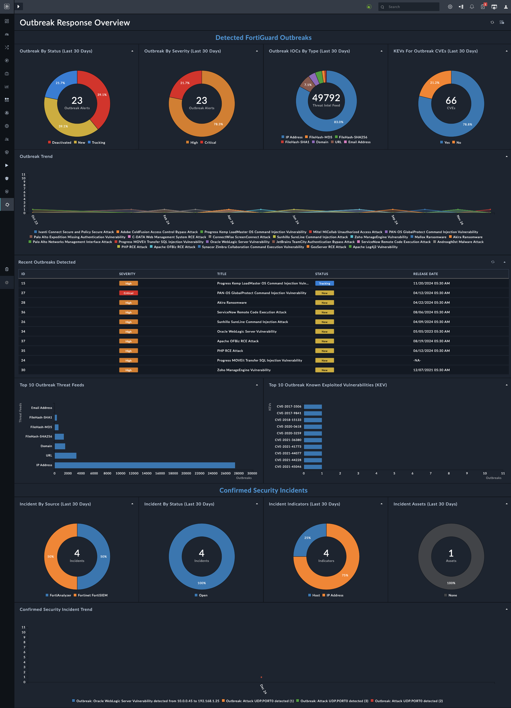

# Release Information 

- **Version**: 2.0.0
- **Certified**: Yes
- **Publisher**: Fortinet
- **Compatible Version**: 7.6.0 and later
- [Release Notes](./release_notes.md)
 
>[!NOTE]
>Preview releases are a beta release. This means that the release is intended to get feedback and might not be best suited for production level deployments. The functionality might change in backward-incompatible ways or have limited support. A beta release is not subject to any SLA, Quality Assurance or deprecation policy. Feature availability and support for preview releases will continue to improve as the solution matures.

## Protect Your Organization with the Outbreak Response Framework

In a world where cyber threats evolve at breakneck speed, the *Outbreak Response Framework* emerges as your first line of defense. Get ahead of the curve with up-to-the-minute intelligence on the latest cybersecurity threats targeting companies, organizations, and industries worldwide. Empower your team to take the reins and fortify your systems against emerging risks.

*FortiGuard Outbreak Alerts* provide key information about on-going cybersecurity attack with significant ramifications affecting numerous companies, organizations and industries. These Outbreak Alerts help understand what happened, the technical details of the attack, and how organizations can protect themselves from this and similar other attacks.

The Alert includes:

- Details of the attack including timeline, technology affected, and where applicable patches/ mitigation recommendations can be found
- Recommended Fortinet products that would break the attack sequence, and threat hunting tools to help you determine if you were affected
- Additional related research from FortiGuard Labs

## Stay Informed with Outbreak Alerts

With FortiSOAR™’s **Outbreak Response Framework** Solution Pack, you gain access to the all-new FortiGuard Outbreak Detection Service. Discover details about fresh threats, be it malware, ransomware, or phishing, along with actionable insights on their impact, mitigation tactics, and the perpetrators behind them.

## Visualize the Threat Landscape

Navigate complex cyber threats effortlessly with our **Outbreak Response Overview** dashboard. It transforms critical data into clear, easy-to-understand visuals, empowering your team to make informed decisions quickly.

## Supercharge Your Threat Hunting

Dive deep into the details of every Outbreak Alert with our robust Threat Hunt Rules. Whether through the centralized power of Fortinet Fabric, the adaptability of Sigma, or the pattern-matching precision of YARA, your organization will be equipped to detect and neutralize threats like never before.

- **Fortinet Fabric Rules**: Harness the centralized might of FortiAnalyzer and the comprehensive coverage of FortiSIEM to monitor, analyze, and report on security events.
- **Sigma Rules**: Collaborate with the cybersecurity community to develop agile, platform-agnostic detection rules.
- **YARA Rules**: Customize your threat detection with scalable, flexible rules that integrate seamlessly into your existing security systems.

Unlock the full potential of your cybersecurity defenses with the *Outbreak Response Framework* &mdash; because in the fight against cyber threats, staying informed and proactive makes all the difference.

## Additional Resources

- [Overview of Outbreak Response Framework](./docs/background-information.md)
- [Using Pluggable Threat Hunting Framework](./docs/pluggable-threat-hunting.md)
- [Triggering and Monitoring Playbooks Using Playbook Execution Wizard](./docs/trigger-and-monitor-pb-with-peb.md)

# Next Steps
| [Installation](./docs/setup.md#installation) | [Configuration](./docs/setup.md#configuration) | [Usage](./docs/usage.md) | [Contents](./docs/contents.md) |
|----------------------------------------------|------------------------------------------------|--------------------------|--------------------------------|