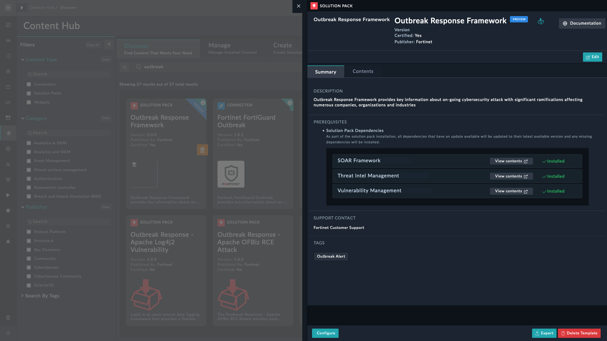
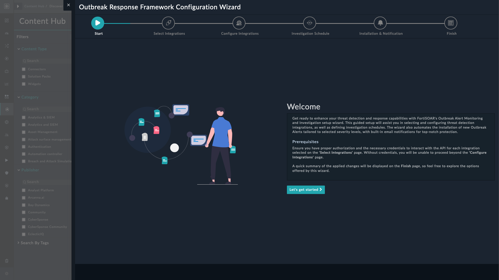
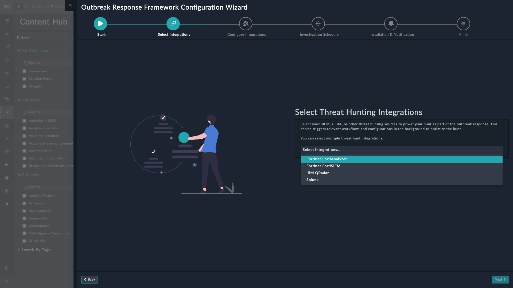
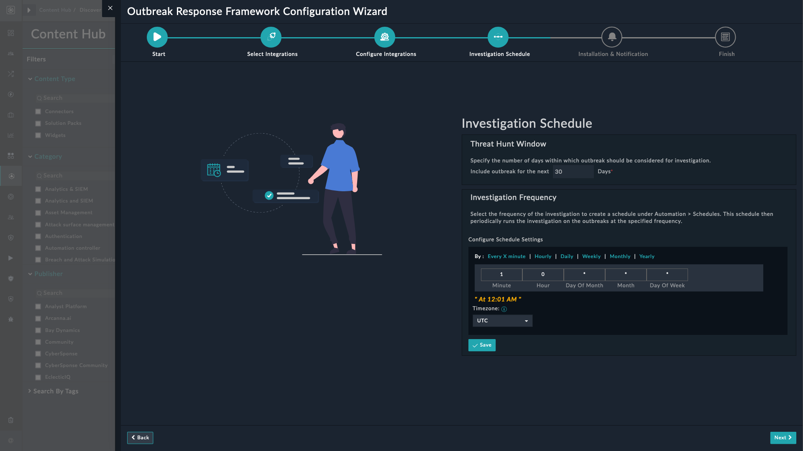
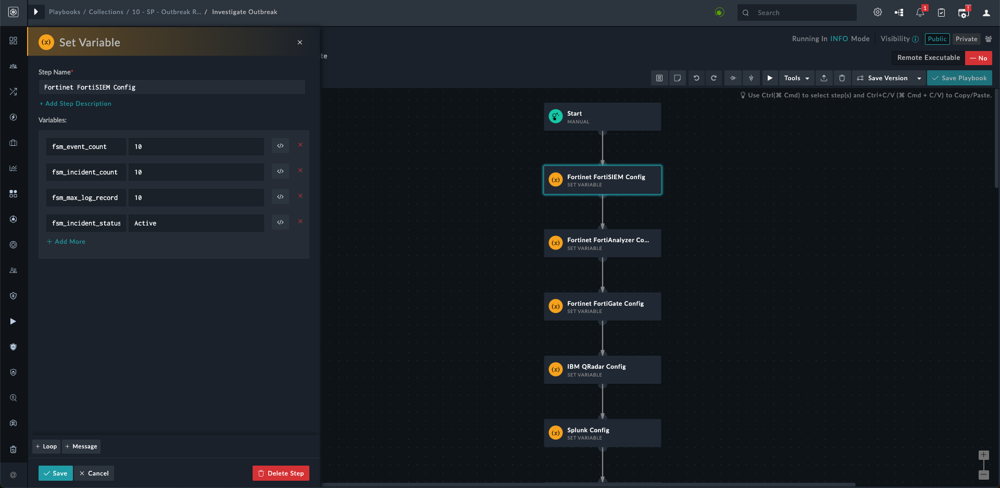
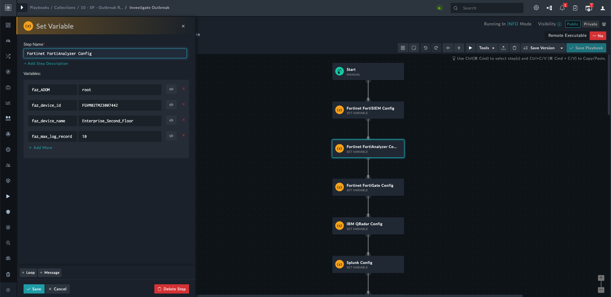
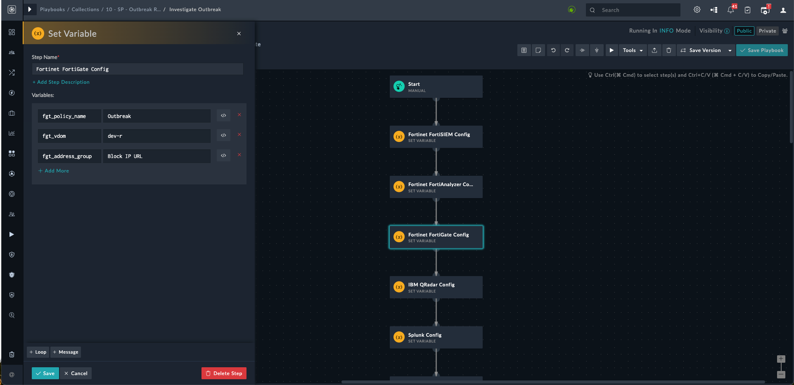
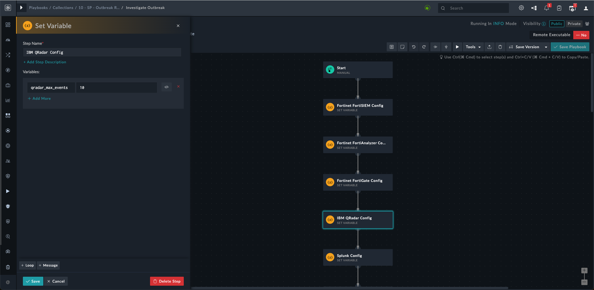
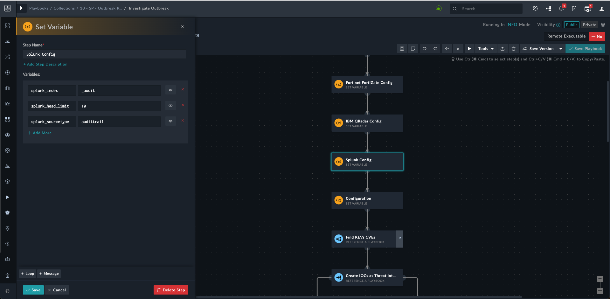

|[Home](../README.md) |
|--------------------------------------------|

# Installation

1. To install a solution pack, click **Content Hub** > **Discover**.
2. From the list of solution packs that appear, search **Outbreak Response Framework**.
3. Click the **Outbreak Response Framework** solution pack card.
4. Click **Install** on the lower part of the screen to begin the installation.

## Prerequisites
The **Outbreak Response Framework** solution pack depends on the following solution packs. These solution packs are installed automatically &ndash; if not already installed.

| Name                     | Type          | Version           | Purpose                                |
|:-------------------------|:--------------|:------------------|:---------------------------------------|
| SOAR Framework           | Solution Pack | v2.2.0 and later  | Required for Incident Response modules |
| Threat Intel Management  | Solution Pack | v1.1.0  and later | Required to ingest threat feeds        |
| Vulnerability Management | Solution Pack | v1.2.1  and later | Required to ingest CVEs for KEVs     |

# Configuration

## Install and Configure Connectors
For optimal performance of the **Outbreak Response Framework** solution pack, install and configure the following connectors:

- **Fortinet FortiGuard Outbreak** - Fortinet FortiGuard Outbreak connector receives communication with *FortiGuard Outbreak Alerts* regarding regarding an outbreak and its details. These alerts help understand the technical details of the attack and how organizations can protect themselves from the attack and others like it. To configure and use the Fortinet FortiGuard Outbreak connector, refer to [Configuring Fortinet FortiGuard Outbreak](https://docs.fortinet.com/fortisoar/connectors/fortinet-fortiGuard-outbreak)

- **Azure Log Analytics** - Azure Log Analytics is a service that helps collect and analyze data generated by resources in your cloud and on-premises environments. To configure and use the Azure Log Analytics connector, refer to [Configuring Azure Log Analytics](https://docs.fortinet.com/fortisoar/connectors/azure-log-analytics)

- **Fortinet FortiAnalyzer** - FortiAnalyzer is the NOC-SOC security analysis tool built with an operations perspective. FortiAnalyzer (FAZ) supports analytics-powered use cases to provide better detection against breaches. To configure and use the Fortinet FortiAnalyzer connector, refer to [Configuring Fortinet FortiAnalyzer](https://docs.fortinet.com/fortisoar/connectors/fortianalyzer)

- **Fortinet FortiSIEM** - Fortinet FortiSIEM is a highly scalable multi-tenant Security Information and Event Management (SIEM) solution that provides real-time infrastructure and user awareness for accurate threat detection, analysis, and reporting. To configure and use the Fortinet FortiSIEM connector, refer to [Configuring Fortinet FortiSIEM](https://docs.fortinet.com/fortisoar/connectors/fortisiem)

- **IBM QRadar** - IBM QRadar SIEM helps your business by detecting anomalies, uncovering advanced threats, and removing false positives. It consolidates log events and network flow data from thousands of devices, endpoints, and applications distributed throughout a network. To configure and use the IBM QRadar connector, refer to [Configuring IBM QRadar](https://docs.fortinet.com/fortisoar/connectors/ibm_qradar)

- **Fortinet FortiGate** - Fortinet FortiGate enterprise firewall provides high performance, consolidated advanced security, and granular visibility for broad protection across the entire digital attack surface. To configure and use the Fortinet FortiGate connector, refer to [Configuring Fortinet FortiGate](https://docs.fortinet.com/fortisoar/connectors/fortigate_firewall)

- **Jira** - Jira is a widely used issue-tracking and project management software developed by Atlassian. It helps teams collaborate, organize, and track their work, tasks, and projects. With features like customizable workflows, agile project management, and extensive reporting capabilities, Jira facilitates efficient project planning, execution, and monitoring. To configure and use the Jira connector, refer to [Configuring Jira](https://docs.fortinet.com/fortisoar/connectors/)

- **NIST National Vulnerability Database** - The NIST National Vulnerability Database (NVD) is the U.S. government repository of standards-based vulnerability management data represented using the Security Content Automation Protocol (SCAP). This data enables automation of vulnerability management, security measurement, and compliance. The NVD includes databases of security checklist references, security-related software flaws, misconfigurations, product names, and impact metrics. To configure and use the NIST National Vulnerability Database connector, refer to [Configuring NIST National Vulnerability Database](https://docs.fortinet.com/fortisoar/connectors/nist-nvd)

- **ServiceNow** - ServiceNow connector provides functionality to create, read, update, and delete records of type Table and Catalog. To configure and use the ServiceNow connector, refer to [Configuring ServiceNow](https://docs.fortinet.com/fortisoar/connectors/servicenow-v2-0-1)
- **Splunk** - Splunk connector allows users to invoke search, fetch events to related search, invoke alert actions, update notables, sync Splunk users to FortiSOAR, etc. To configure and use the Splunk connector, refer to [Configuring Splunk](https://docs.fortinet.com/fortisoar/connectors/splunk_new)

## Setup Outbreak Response Framework on FortiSOAR

After installation of the **Outbreak Response Framework** solution pack, run the configuration wizard to ready your FortiSOAR environment to investigate Outbreak Alerts. This wizard helps you select the configured "Threat Detection Integrations" and "Ticketing/ITSM Integrations" on FortiSOAR.

1. Log in to FortiSOAR, after [installation](#installation) completes.

2. Click the button **Configure** from the lower-left of the screen.

    

3. Click the button **Let's get started** on the Outbreak Response Framework configuration page.

    

4. Select Threat Detection Integration sources to run outbreak response hunt activities and click **Next**.

    The hunt activities require searching for adversaries and their tactics, within an environment, against existing information available in the Threat Intel Platform's database (TIP). The Threat Detection Integration sources help run the threat hunt activities and are an important part of the *Outbreak Response Framework*.

    

5. Select Ticketing/ITSM Integration sources as part of your response or threat management strategy and click **Next**.

    Ticketing systems allow teams to organize, describe, and archive event investigations and incidents. For each hunt conducted, an integrated ticketing solution helps track and ease managing of alerts and incidents.

    

6. Click **Finish** to complete the configuration process.
    

## Configure the Threat Detection Integration Parameters

Each Threat Detection Integration requires some configuration changes.

1. Open the **Investigate Outbreak** playbook from the *10 - SP - Outbreak Response Framework* playbook collection.

2. Open the **Set Variable** step for each configured threat detection integration.

3. Create variables for each configured threat detection integration as follows:

    1. For **Fortinet FortiSIEM** configuration create and specify values for following variables:

        - `fsm_event_count`
        - `fsm_incident_count`
        - `fsm_max_log_record`
        - `fsm_incident_status`

        Following screenshot shows the variables with example values:

        

    2. For **Fortinet FortiAnalyzer** configuration create following variables:

        - `faz_ADOM`
        - `faz_device_id`
        - `faz_device_name`
        - `faz_max_log_record`

        Following screenshot shows the variables with example values:

        

    3. For **Fortinet FortiGate** configuration create and specify values for following variables:

        - `fgt_policy_name`
        - `fgt_address_group`
        - `fgt_vdom`

        Following screenshot shows the variables with example values:

        

    4. For **IBM QRadar** configuration create and specify values for following variables:

        - `qradar_max_events`

        Following screenshot shows the variables with example values:

        

    5. For **Splunk** configuration create and specify values for following variables:

        - `splunk_index`
        - `splunk_head_limit`
        - `splunk_sourcetype`

        Following screenshot shows the variables with example values:

        

## Adding New Threat Detection or Ticketing Integrations

To add new *Threat Detection Integrations* or *Ticketing/ITSM Integrations* apart from the ones listed in the **Configuration Wizard**, consider the following pointers:

1. **Install and Configure Connectors**: The connectors for new integrations &mdash; threat detection or ticketing/ITSM &mdash; must be installed and configured with appropriately authorized credentials.

2. **Add Integrations to Picklist**: Refer to *Creating or Modifying a Picklist* section in the [FortiSOAR Administration Guide](https://docs.fortinet.com/document/fortisoar/7.4.2/administration-guide/97786/application-editor#Creating_or_modifying_a_picklist) to add items in a picklist.

    1. Add the name of the new threat detection integration as a new picklist under *Threat Hunt Tools*.

    2. Add the name of the new ticketing/ITSM integration as a new picklist under *Ticketing Tools*.

3. **Add the new tools in Configuration Wizard**

    1. Run the **Outbreak Response Framework** configuration wizard.
    
    2. Select the previous and the newly added integrations.

        You can have multiple tools in *Threat Detection Integrations* and only one in *Ticketing/ITSM Integrations*.

4. **Variable Modifications**: The following global variables must never be modified or deleted:
    
    a. `ticketing_integrations`

    b. `threat_hunt_integrations`

# Next Steps

| [Usage](./usage.md) | [Contents](./contents.md) |
|---------------------|---------------------------|