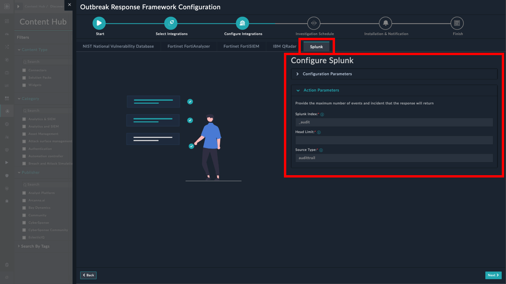

|[Home](../README.md) |
|--------------------------------------------|

# Installation

1. To install a solution pack, click **Content Hub** > **Discover**.
2. From the list of solution packs that appear, search **Outbreak Response Framework**.
3. Click the **Outbreak Response Framework** solution pack card.
4. Click **Install** on the lower part of the screen to begin the installation.

## Prerequisites
The **Outbreak Response Framework** solution pack depends on the following solution packs. These solution packs are installed automatically &ndash; if not already installed.

| Name                     | Type          | Version           | Purpose                                |
|:-------------------------|:--------------|:------------------|:---------------------------------------|
| SOAR Framework           | Solution Pack | v3.0.0 and later  | Required for Incident Response modules |
| Threat Intel Management  | Solution Pack | v1.2.2  and later | Required to ingest threat feeds        |
| Vulnerability Management | Solution Pack | v2.1.0  and later | Required to ingest CVEs for KEVs       |

# Configuration

## Install and Configure Connectors
For optimal performance of the **Outbreak Response Framework** solution pack, install and configure the following connectors:

- **Fortinet FortiGuard Outbreak** - Fortinet FortiGuard Outbreak connector receives communication with *FortiGuard Outbreak Alerts* regarding regarding an outbreak and its details. These alerts help understand the technical details of the attack and how organizations can protect themselves from the attack and others like it. To configure and use the Fortinet FortiGuard Outbreak connector, refer to [Configuring Fortinet FortiGuard Outbreak](https://docs.fortinet.com/fortisoar/connectors/fortinet-fortiGuard-outbreak)

- **Fortinet FortiAnalyzer** - FortiAnalyzer is the NOC-SOC security analysis tool built with an operations perspective. FortiAnalyzer (FAZ) supports analytics-powered use cases to provide better detection against breaches. To configure and use the Fortinet FortiAnalyzer connector, refer to [Configuring Fortinet FortiAnalyzer](https://docs.fortinet.com/fortisoar/connectors/fortianalyzer)

- **Fortinet FortiSIEM** - Fortinet FortiSIEM is a highly scalable multi-tenant Security Information and Event Management (SIEM) solution that provides real-time infrastructure and user awareness for accurate threat detection, analysis, and reporting. To configure and use the Fortinet FortiSIEM connector, refer to [Configuring Fortinet FortiSIEM](https://docs.fortinet.com/fortisoar/connectors/fortisiem)

- **IBM QRadar** - IBM QRadar SIEM helps your business by detecting anomalies, uncovering advanced threats, and removing false positives. It consolidates log events and network flow data from thousands of devices, endpoints, and applications distributed throughout a network. To configure and use the IBM QRadar connector, refer to [Configuring IBM QRadar](https://docs.fortinet.com/fortisoar/connectors/ibm_qradar)

- **NIST National Vulnerability Database** - The NIST National Vulnerability Database (NVD) is the U.S. government repository of standards-based vulnerability management data represented using the Security Content Automation Protocol (SCAP). This data enables automation of vulnerability management, security measurement, and compliance. The NVD includes databases of security checklist references, security-related software flaws, misconfigurations, product names, and impact metrics. To configure and use the NIST National Vulnerability Database connector, refer to [Configuring NIST National Vulnerability Database](https://docs.fortinet.com/fortisoar/connectors/nist-nvd)

- **Splunk** - Splunk connector allows users to invoke search, fetch events to related search, invoke alert actions, update notables, sync Splunk users to FortiSOAR, etc. To configure and use the Splunk connector, refer to [Configuring Splunk](https://docs.fortinet.com/fortisoar/connectors/splunk_new)

## Setup Outbreak Response Framework on FortiSOAR

After installation of the **Outbreak Response Framework** solution pack, run the configuration wizard to ready your FortiSOAR environment to investigate Outbreak Alerts. This wizard helps you select and configure **Threat Detection Integrations** on FortiSOAR.

1. Log in to FortiSOAR, after [installation](#installation) completes.

2. Click the button **Configure** from the lower-left of the screen.

    

3. Click the button **Let's get started** on the Outbreak Response Framework configuration page.

    

4. **Select Integrations**
    
    - Select Threat Detection Integration sources to run outbreak response hunt activities and click **Next**.

        The hunt activities require searching for adversaries and their tactics, within an environment, against existing information available in the Threat Intel Platform's database (TIP). The Threat Detection Integration sources help run the threat hunt activities and are an important part of the *Outbreak Response Framework*.

    

5. **Configure Integrations**

    - Select each integration's tab to configure the associated connector and data ingestion parameters. 

        The page has separate tabs for each integration selected as a threat detection source:

    

6. **Investigation Schedule**

    

    - **Threat Hunt Window**: Specify the number of days as an interval within which outbreak should be considered for investigation.

    - **Investigation Frequency**:  Select the frequency of the investigation to create a schedule. The created schedule can be found under *Automation* > *Schedules*. Once created, the schedule periodically runs the investigation on the reported outbreaks at the specified frequency.

7. **Installation & Notification**

    

    - **Auto Installation Criteria**: Select the severity of the outbreak to install the corresponding solution pack. You can select one or more severity from the following options:
        - *Critical*
        - *High*
        - *Medium*

    - **Outbreak Alert Update Notification**:  Specify email addresses authorized to receive outbreak updates. You can specify multiple email addresses separated by a comma.

8. **Summary**

    Click the button **Ingest Now** to install the outbreak-specific response solution packs of the severity selected on the previous screen.

    Click **Finish** to complete the configuration process.

    

# Next Steps

| [Usage](./usage.md) | [Contents](./contents.md) |
|---------------------|---------------------------|