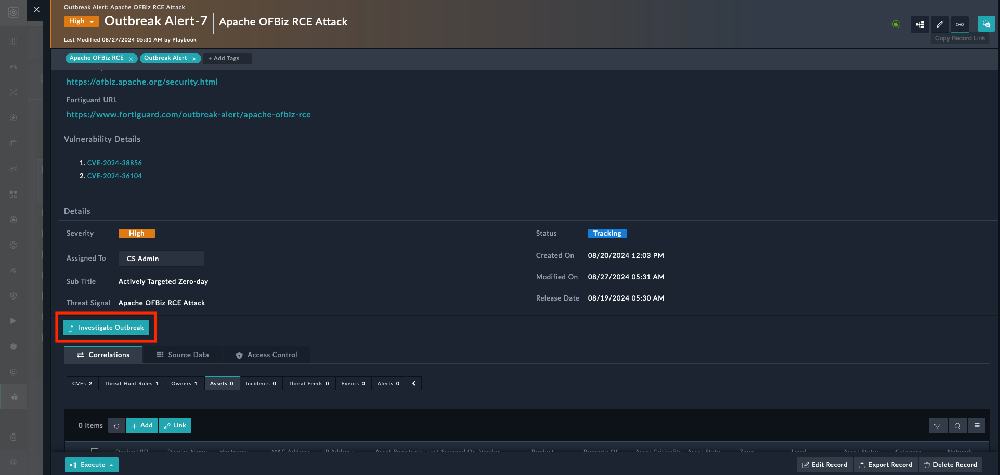
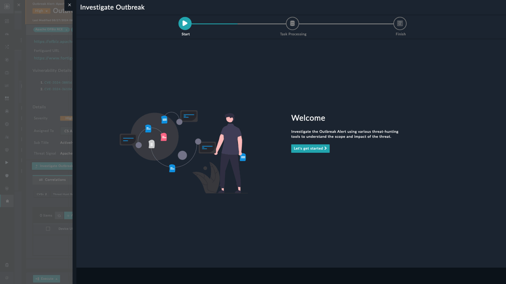

| [Home](../README.md) |
| -------------------- |

# Triggering and Monitoring Playbooks

To facilitate manual investigations of outbreak alerts, the Outbreak Response Framework integrates a **Playbook Buttons** widget. This widget enables analysts to quickly locate and trigger the _Investigate Outbreak Alert_ playbook directly from the Playbook Execution Wizard interface. The Playbook Execution Wizard allows users to monitor the status of the investigation by tracking executing tasks and reviewing the playbook execution history.

1. **Accessing the Playbook Buttons Widget**
   The **Playbook Buttons** widget appears when you open an outbreak alert listed on the **Outbreaks**tab.

   

2. **Triggering the _Investigate Outbreak Alert_ Playbook**
    
    To begin a manual investigation:

   - Navigate to the detailed view of an *Outbreak* alert.
   - Click the _Investigate Outbreak Alert_ button.
   - This action triggers the _Investigate Outbreak Alert_ playbook, initiating the investigation process.

    For detailed information about configuring and using the **Playbook Buttons** widget, refer to: [Playbook Buttons Documentation](https://github.com/fortinet-fortisoar/widget-playbook-buttons/tree/release/1.0.1).

3. **Monitoring the Investigation with the Playbook Execution Wizard**
   After triggering the investigation playbook, the **Playbook Execution Wizard** launches to provide the investigation's progress. The wizard allows you to:
   
   - **Visualize Executing Tasks**: View real-time updates on the tasks being executed as part of the investigation.
   - **Review Playbook Execution History**: Access a detailed log of previous executions, which helps in understanding the sequence of actions and any issues that might have occurred.

        

   - For detailed information about configuring and using the Playbook Execution Wizard, refer to: [Playbook Execution Wizard Documentation](https://github.com/fortinet-fortisoar/widget-playbook-execution-wizard/tree/release/1.0.0).

The integration of the Playbook Buttons widget and the Playbook Execution Wizard significantly enhances the ability of SOC analysts to manually investigate outbreak alerts. By providing direct access to essential playbooks and real-time monitoring of the investigation process, these tools streamline the manual investigation workflow, ensuring timely and effective responses to emerging threats.

# Next Steps

| [Installation](./setup.md#installation) | [Configuration](./setup.md#configuration) | [Usage](./usage.md) |
|-----------------------------------------|-------------------------------------------|---------------------|