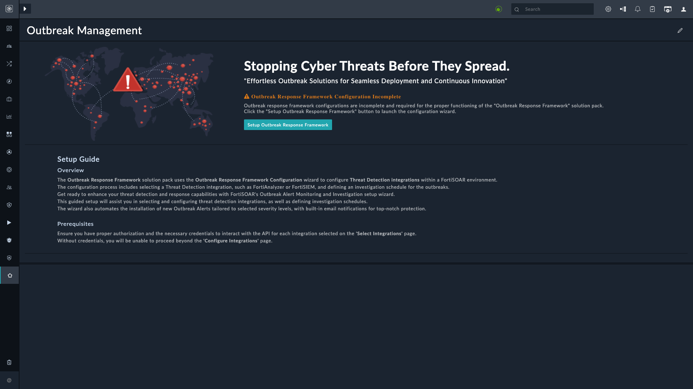

| [Home](../README.md) |
|----------------------|

# Upgrade Instructions

This section points out some actions to take after the upgrade to **Outbreak Response Framework** `v2.1.0`.

> **IMPORTANT**: Follow these instructions closely and do not skip.

## Prerequisites

- Upgrade Fortinet FortiAnalyzer connector to `v3.3.0` or later

## After Upgrade

### Deleting Duplicate Threat Feeds

With the release of the **Outbreak Response Framework** solution pack `v2.1.0` and later, the field *Type* in Threat Intel Feeds is mapped to specific hash type (*`FileHash-MD5`*, *`FileHash-SHA1`*, and *`FileHash-SHA256`*) instead of the generic *`FileHash`*. This change results in ingestion and creation of duplicate threat feeds for outbreak alerts with the status *`Tracking`* since the uniqueness constraint on threat feeds is the combination (AND) of the fields **Value, Type, and Source** instead of just **Value**.

#### Resolution

Before initiating an investigation, perform the following steps:

1. **Delete Threat Feeds**:

    - Manually delete all threat feeds of type FileHash associated with outbreak alerts with the status Tracking.
    - This ensures outdated and duplicate feeds are cleared before re-fetching begins.

2. **Re-Fetch Threat Feeds**:

    - The schedule `Outbreak_Ingest-Tracking-Outbreak-CVEs-and-IOCs` automatically triggers the playbooks for fetching threat feeds.

    - You can manually run this playbook to manually fetch threat feeds after the upgrade.
        1. Select outbreak alerts from Outbreak Alerts page.
        2. Click **Execute** > **Get Outbreak CVEs and IOCs Details**.

    
### Configuring the Key Store

After upgrade users may see the following screen, or a blank screen, instead of the **Outbreak Alerts** page:

#### Resolution

Run the **Outbreak Response Framework** configuration wizard again. For information on the wizard, refer [Configuration Wizard](./setup.md#setup-outbreak-response-framework-on-fortisoar).

Users see the following **Outbreak Alerts** page after a successful configuration:

# Next Steps

| [Installation](./setup.md#installation) | [Configuration](./setup.md#configuration) | [Contents](./contents.md) |
|-----------------------------------------|-------------------------------------------|---------------------------|
