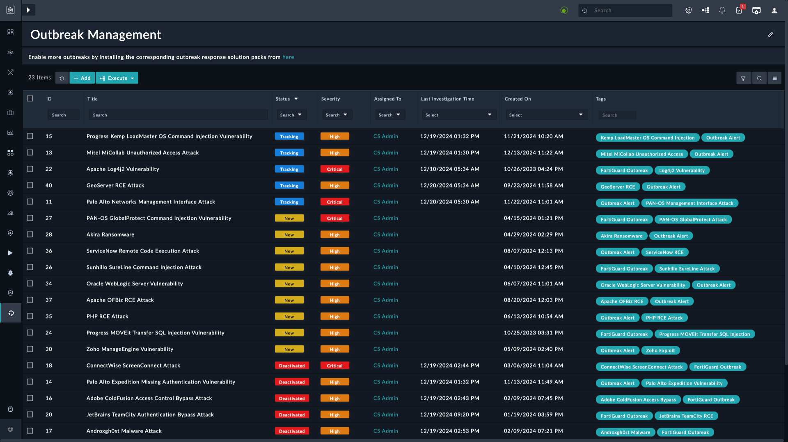

| [Home](../README.md) |
|----------------------|

# Upgrade Instructions

This section points out some actions to take after the upgrade to **Outbreak Response Framework** `v2.1.0`.

> **IMPORTANT**: Follow these instructions closely and do not skip.

## Prerequisites

- Upgrade Fortinet FortiAnalyzer connector to `v3.3.0` or later

## After Upgrade

After upgrade users may see the following screen instead of Outbreak Alerts page:

Run the **Outbreak Response Framework** configuration wizard again. For information on the wizard, refer [Configuration Wizard](./setup.md#setup-outbreak-response-framework-on-fortisoar).

Once configured the users see the following Outbreak Alerts page:

> [!Note]
> The count of outbreak alerts that appear on the Outbreak Alerts page depends on the Outbreak Response solution packs installed.

# Next Steps

| [Installation](./setup.md#installation) | [Configuration](./setup.md#configuration) | [Contents](./contents.md) |
|-----------------------------------------|-------------------------------------------|---------------------------|
