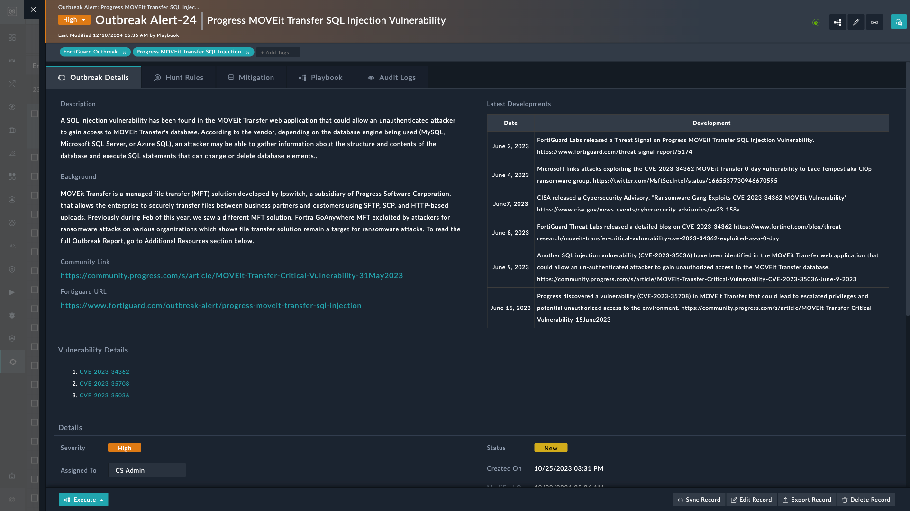

| [Home](../README.md) |
|----------------------|

# Usage

In this section, we detail the various user flows to understand the scenarios where this solution pack’s automation may address your needs.

## Outbreak Response Framework Flowchart 
 
The following is an ideal flow to use the **Outbreak Response Framework** solution pack:

1. Install **Outbreak Response Framework** solution pack.

2. Complete the *Outbreak Response Framework*'s **Configuration Wizard**. The [Setup](./setup.md#setup-outbreak-response-framework-on-fortisoar) section details the configuration process.

3. Install individual *Outbreak Response* solution packs.
    
>[!Note]
>The [**EXAMPLE: Outbreak Response - Progress MOVEit Transfer SQL Injection Vulnerability**](#example-outbreak-response---progress-moveit-transfer-sql-injection-vulnerability) section explains the response of **Outbreak Response Framework** solution pack to *Progress MOVEit Transfer SQL Injection Vulnerability* by way of an example.

4. **Fetch CVEs for KEVs**: Using [NIST](https://docs.fortinet.com/fortisoar/connectors/nist-nvd) integration FortiSOAR checks if an associated CVE is tagged as a KEV. Once found, it creates CVE records in the vulnerability module and links those records to outbreak alerts.

5. **Ingest IOCs as Threat Feeds**: IOCs associated with the Outbreak are ingested as threat feeds in FortiSOAR using Fortinet FortiGuard Outbreak connector.

    Users are notified and the alert severity is raised if an alert containing these IOCs is found in FortiSOAR.

6. **IOC Threat Hunt**: You can perform IOC Threat Hunt, and create IOC hunt incidents of type *Outbreak* in FortiSOAR, using any of the following:

    - Fortinet Fabric solutions (FortiSIEM/FortiAnalyzer)

    - Other SIEM solutions (QRadar/Splunk)

7. **Sigma Rules**: You can perform signature Based Threat Hunt using Sigma Rules:

    1. Perform Signature-based Threat Hunting using Fortinet Fabric solutions (FortiSIEM/FortiAnalyzer) and create incidents of type *Outbreak* in FortiSOAR.

        

        

    2. Perform Signature-based Threat Hunting using other SIEM solutions (QRadar/Splunk) and create incidents of type *Outbreak* in FortiSOAR.

        

        Once investigation completes, an incident is created using the targeted IoCs found.

        

8. **Mitigation**: Every Outbreak Alert has associated mitigation. FortiSOAR provides the mitigation recommendations using public sources, like patch available, etc.

    

## Example: Outbreak Response - Progress MOVEit Transfer SQL Injection Vulnerability

Before performing the steps outlined in this section, we recommend setting the global variable `Demo_mode` to `true`. Once done, the following steps generate example data for a better understanding of this solution packs functionality.

1. Install **Outbreak Response Framework** Solution Pack.

2. Complete the *Outbreak Response Framework*'s **Configuration Wizard**.

3. Install **Outbreak Response - Progress MOVEit Transfer SQL Injection Vulnerability**.

4. Navigate to the **Outbreak Management** menu and select **Outbreaks** tab to view the following screen:

    

6. Click to open the alert and view the following screen that contains description and background information:

    

7. Click the **Execute** button and select **Investigate Outbreak** to begin investigation. Since the global variable `Demo_mode` is set to `true`, you are given example data to view and understand the information retrieved from investigation.

    Alternatively, you can click **Investigate Outbreak** button on an Outbreak Alert's detailed view page to get the following wizard:

    

8. Scroll the alert details page to view CVE IDs, correlations, and alerts, apart from other information:

    

    The following information becomes available as the **Outbreak Response** solution pack creates the following:

    1. **Outbreak Alerts**: The outbreak alert contain the following

        - Outbreak Alert details

        - Mitigation Details

    2. **Threat Hunt Rules**: The following rules are imported with outbreak-specific response solution pack:

        - **Yara Rules**: YARA Rules help malware researchers identify and classify malware samples that focus on scanning and identifying malicious files.

        

        - **Sigma Rules**: Sigma Rules provide a standard format for log events. They are helpful in searching or pattern matching through log data.
        
        Using Sigma Rules we can create signature-based Threat Hunt Rules for various Threat Detection Integrations like SIEM, Analyzer, or EDR.
        
        - **Fortinet Fabric Rules**: With every Outbreak Alert FortiGuard provides FortiAnalyzer and FortiSIEM as part of Fortinet fabric solution.

9. Select the **Dashboard** tab, under *Outbreak Management*, to view following information:

    

# Next Steps

| [Installation](./setup.md#installation) | [Configuration](./setup.md#configuration) | [Contents](./contents.md) |
|-----------------------------------------|-------------------------------------------|---------------------------|